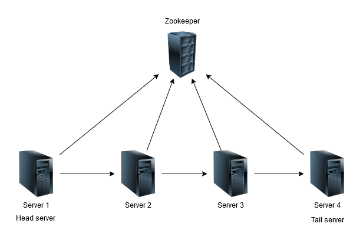
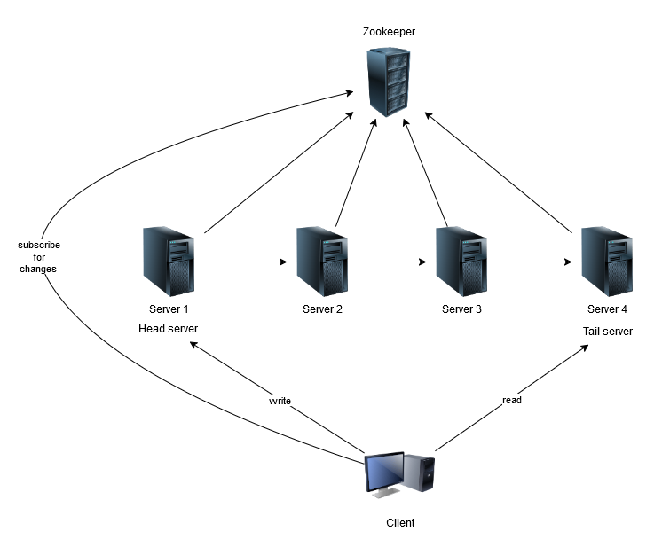
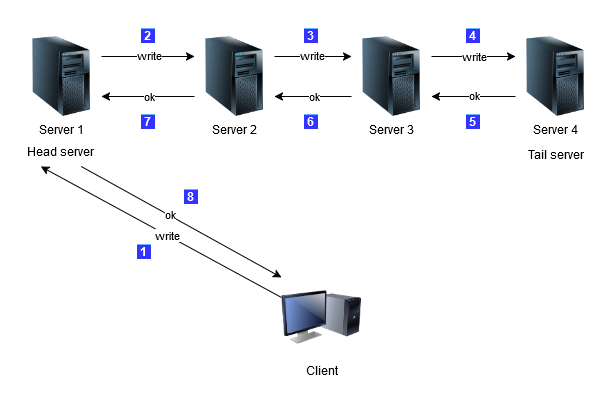

## Distributed replicated key-value store

### Overview
A fast and efficient replicated key-value store written in C. Fault resistent by employing the primary-backup model with passive replication, using ZooKeeper to coordinate the replicas.

This project is developed within the course of Distributed Systems at FCUL.

**Co-authors**: [Gonçalo Pinto](https://github.com/GoncaloP0710) & [Guilherme Wind](https://github.com/guilherme-wind)

### Table of contents
- [Getting started](#getting-started)
- [Building](#building)
- [Deployment](#deployment)
  - [Server](#server)
  - [Client](#client)
- [System architecture](#system-architecture)
- [Feedback](#feedback)
- [License](#license)

### Getting started
This program is built for Linux environment, the [zookeeper](https://zookeeper.apache.org/index.html), [protobuf compiler](https://grpc.io/docs/protoc-installation/) and [gcc](https://gcc.gnu.org/) are required to compile and run the project.

### Building
To build the project, create the folders `binary`, `lib` and `dependencies` in the root folder of the project if they don't exist already.
Run `make clean` to ensure that there are no remaining residue files in these folders.
Execute `make` or `make all` to compile the client and server excutables, the generated excutable files are stored in the `binary` folder.

### Deployment
Before deploying servers and clients, please make sure the zookeeper is running.
- #### Server
    To launch the server, use the following command:
    ```sh
    ./binary/table_server <port> <table size> [<zookeeper ip>:<zookeeper port>]
    ```
    Where `port` is the port where the server will be listening on for client connections and `table size` is the initial size of the store.
    Additionally, it's possible to pass the socket of zookeeper as argument, if this optional parameter is not supplied, the server will try to connect to zookeeper at `127.0.0.1:2181`.

- #### Client
    To run client, use the following command:
    ```sh
    ./binary/table_client <zookeeper ip>:<zookeeper port>
    ```
    The socket of zookeeper is a mandatory argument to launch the client.

### System architecture
This system is designed to be fault tolerant, this is achieved by using zookeeper to keep track of the active servers as each one of them will create an ephemeral node with a unique identifier that contains the information about it's socket. The identifiers are sequential, i.e., the server with the lowest id is the oldest and the newest server has the highest id. We call the oldest server 'head' and the newest 'tail'.

The servers are connected from the head to the tail sequential order, forming a chain, as shown in the following image.


When a client launches, it will find the head and tail in zookeeper and connect to them. Write operations will be sent to the head server while read operations are performed on the tail server, this is to avoid overloading a single machine. The client also listens for any changes in zookeeper to keep track of the head and tail.


The head server will propagate writes to the other servers, meanwhile the write is performed on all servers, the head is blocked.


### Feedback
For any questions or feedback, please feel free to reach out to me at wangxiting01917@gmail.com.

### License
This project is licensed under the MIT License - see the [LICENSE](LICENSE) file for details.